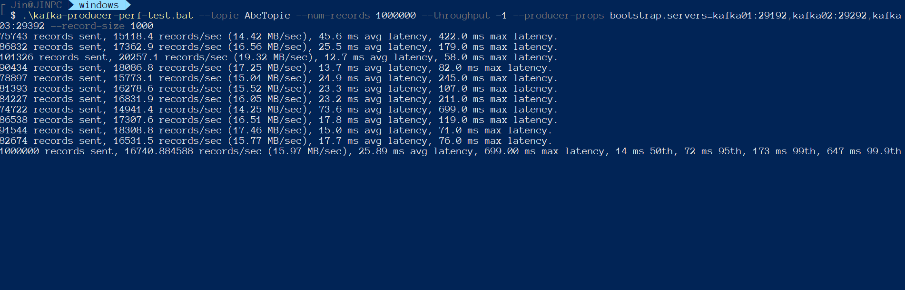
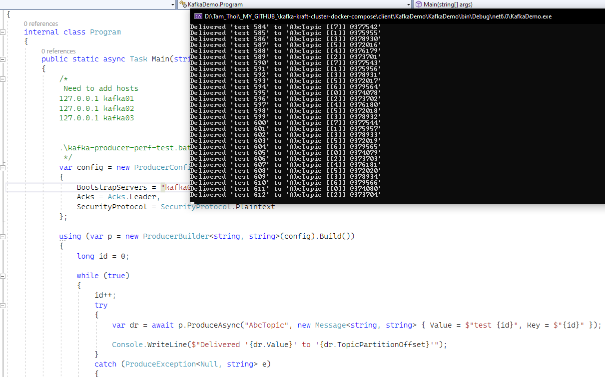

# KAFKA CLUSTER KRAFT MODE - DOCKER COMPOSE

- 3 nodes
- UI using `kafka UI` http://localhost:8080/
- UI using `kouncil` http://localhost:8082/

## How to run

```
docker-compose up -d
```

Before connecting to cluster from outside docker ( ex from your docker host - your PC ), we also need to config host file :
Example for windows:

```
127.0.0.1 kafka01
127.0.0.1 kafka02
127.0.0.1 kafka03
```

###Done !###

## Connection string (public)

> kafka01:29192,kafka02:29292,kafka03:29392


### .NET Demo (run outside docker)

[Check here](https://github.com/minhhungit/kafka-kraft-cluster-docker-compose/tree/main/client/KafkaDemo)

### Or run demo directly inside docker using bellow commands:

```
docker run -it --rm --network kafka-kraft-cluster-docker-compose_default confluentinc/cp-kafka /bin/kafka-console-producer --bootstrap-server kafka01:9092 --topic test_topic
```

then enter some text to produce message


or run performance test

```
docker run -it --rm --network kafka-kraft-cluster-docker-compose_default confluentinc/cp-kafka /bin/kafka-producer-perf-test --topic test_topic --num-records 1000000 --throughput -1 --producer-props bootstrap.servers=kafka01:9092 batch.size=16384 acks=1 linger.ms=50 --record-size 1000

```




